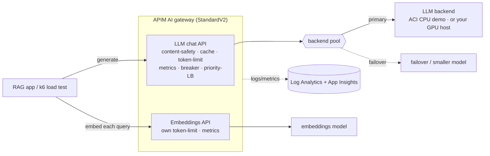
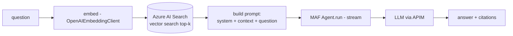

# Azure API Management as an AI Gateway for LLMs

A self-contained reference that puts **Azure API Management (APIM) as an AI
gateway** in front of **self-hosted / open LLM backends** — an LLM for
generation plus an embeddings model for retrieval — and answers two questions
every team running its own AI models eventually hits:

1. **Capacity** — what is the real maximum concurrent-user load the model
   backend can serve before latency and errors degrade? (measured by load testing)
2. **Protection** — when demand exceeds that ceiling, how does the gateway
   **throttle or fail over** so the backend degrades *gracefully* instead of
   collapsing for everyone?

Self-hosted LLMs (open-weight models on your own GPUs) give control over cost,
data residency, and latency — but they have a hard capacity ceiling and no
built-in governance. An AI gateway in front of them adds token-based rate
limiting, circuit breaking, load-balanced failover, content safety, semantic
caching, and per-token observability **without changing the models**.

> **Model hosting in this repo.** So that anyone with an Azure subscription and
> **no GPU quota** can run the whole thing, the model backends run on **Azure
> Container Instances (CPU)** using small open models — `qwen3:1.7b` (a reasoning
> LLM) and `qwen3-embedding:0.6b`. They stand in for a real deployment so you
> can exercise the gateway end-to-end. **Swap in your own GPU-hosted LLM** (for
> example an open-weight model such as `gpt-oss` on H100s) by pointing the APIM
> backend at its OpenAI-compatible endpoint — nothing else changes.

> Clone it, stand it up on Azure, and load-test it end-to-end.

## Architecture



> The RAG app calls **two** models per request — embeddings (retrieval) and the
> LLM (generation) — so **both** route through APIM (`EMBED_BASE_URL` +
> `LLM_BASE_URL`). The knowledge store is **Azure AI Search** — a direct app
> dependency (a database, not a model).

Two backends, **same code and same gateway** — switch with one env var:

| | Demo backend (this repo) | Your own backend |
| --- | --- | --- |
| Model host | Azure Container Instances — CPU, no GPU | self-hosted LLM on GPUs (e.g. H100s) |
| Models | `qwen3:1.7b` + `qwen3-embedding:0.6b` (small, open) | your production LLM + embeddings |
| Purpose | prove the gateway policies end-to-end | real capacity + protection numbers |

## How the PoC runs — 3 phases

| Phase | What | Target |
| --- | --- | --- |
| **1 · Baseline** | Load-test the **LLM backend directly** to find the raw concurrent-user ceiling (TTFT / error inflection). | backend |
| **2 · Gateway** | Stand up APIM, import the models, wire the policies. | APIM |
| **3 · Validate** | Re-run the **same** load test through APIM; prove it throttles / fails over **before** the backend degrades. | APIM → backend |

APIM can't see GPU / KV-cache pressure, so the capacity number must come from the
Phase-1 external load test — the policies are then tuned to stay under it.

## RAG agent internals (`03-app/`)



Deterministic retrieve-then-generate — doesn't depend on model tool-calling.

## Tech stack

| Layer | Choice |
| --- | --- |
| Gateway | Azure API Management **StandardV2** (AI-gateway policies) |
| IaC | **Terraform** + Azure Verified Modules (pinned) |
| RAG app | **Microsoft Agent Framework** (Python 3.13) + FastAPI + Uvicorn |
| Knowledge store | **Azure AI Search** (vector) |
| Model serving | Azure Container Instances (OpenAI-compatible, **CPU demo**) — swap for a self-hosted GPU LLM |
| Demo models | `qwen3:1.7b` (reasoning LLM) + `qwen3-embedding:0.6b` |
| Load test | **k6** + `xk6-sse` (streamed: TTFT, inter-token, throughput, errors) |
| Observability | Log Analytics + Application Insights |

## Repository layout

| Path | What |
| --- | --- |
| [`00-infra/`](00-infra/) | Terraform — APIM + Log Analytics + App Insights + ACR + Azure AI Search + Content Safety + Managed Redis |
| [`01-models/`](01-models/) | Model serving — Ollama image + Azure Container Instance (OpenAI-compatible backends) |
| [`02-apim/`](02-apim/) | AI-gateway config — LLM + Embeddings APIs, backends, policies |
| [`03-app/`](03-app/) | RAG agent — MAF + Azure AI Search, FastAPI |
| [`04-load-tests/`](04-load-tests/) | k6 baseline (same script for backend & gateway) |

## Prerequisites

| Tool | For |
| --- | --- |
| [Terraform](https://developer.hashicorp.com/terraform) ≥ 1.9 + Azure CLI | provision `00-infra` / `01-models` / `02-apim` (`az login`) |
| [uv](https://docs.astral.sh/uv/) | Python 3.13 env for `03-app/` |
| Go | build k6 with the SSE extension (one-time) |

## Quick start (Azure)

Deploy in dependency order — **00-infra → 01-models → 02-apim** — then seed and test.

```bash
az login

# 1) base plane + AI Search + ACR + (optional) Content Safety / Redis
cd 00-infra
cp terraform.tfvars.example terraform.tfvars   # publisher_email, region, sku
terraform init && terraform apply

# 2) build the model image and deploy the container backend
cd ../01-models
./build.sh                                      # az acr build the Ollama image
terraform init && terraform apply

# 3) configure the APIM AI gateway (imports both APIs + policies)
cd ../02-apim
terraform init && terraform apply
```

Seed the knowledge base and run the app against the gateway:

```bash
cd ../03-app
uv venv --python 3.13 .venv && source .venv/bin/activate
uv pip install -e .

cp .env.example .env        # fill from the Terraform outputs:
#   SEARCH_ENDPOINT / SEARCH_API_KEY  <- terraform -chdir=../00-infra output
#   LLM_BASE_URL   = https://<apim>.azure-api.net/gpt-oss
#   EMBED_BASE_URL = https://<apim>.azure-api.net/embeddings
#   LLM_API_KEY = EMBED_API_KEY = <apim subscription key>
python -m scripts.seed      # embeds sample docs into the AI Search index
uvicorn rag_app.api:app --port 8000
```

Ask it something (grounded answer + citations):

```bash
curl -s localhost:8000/health

curl -s localhost:8000/chat -H 'content-type: application/json' \
  -d '{"question":"What is the earliest signal of saturation and why?"}' | jq
```

Load-test through the gateway (build k6 with SSE once, then run):

```bash
cd ../04-load-tests
go install go.k6.io/xk6/cmd/xk6@latest
xk6 build --with github.com/phymbert/xk6-sse       # produces ./k6

BASE_URL=https://<apim>.azure-api.net CHAT_PATH=/gpt-oss/chat/completions \
API_KEY_HEADER=api-key API_KEY_PREFIX= API_KEY=<apim-subscription-key> \
./k6 run baseline-test.js
```

> APIM onboarding follows Microsoft's [self-hosted-ollama](https://github.com/Azure-Samples/AI-Gateway/tree/main/labs/self-hosted-ollama)
> lab pattern: catch-all `/{*path}` operations + an `api-key` subscription
> header. The backend URL ends in `/v1`, so client base URLs omit `/v1`.

Then watch tokens / latency / throttling in **Application Insights** (or the
optional dev portal, below).

## What the load test measures

Streamed (SSE) so time-to-first-token is real, tagged by prompt size
(`short` / `medium` / `long`):

| Metric | k6 name | Signal |
| --- | --- | --- |
| Time to first token | `llm_ttft_ms` | **leading** saturation indicator |
| Inter-token latency | `llm_inter_token_ms` | decode-tier pressure |
| Total latency | `llm_total_latency_ms` | end-to-end UX |
| Throughput / req | `llm_tokens_per_sec` | per-request decode rate |
| Aggregate tokens | `llm_output_tokens_total` | cluster goodput |
| Error rate | `llm_errors` | hard capacity ceiling |

> Open LLMs such as `qwen3` and `gpt-oss` are **reasoning models** — they stream
> a thinking phase before the visible answer. The harness counts reasoning **and**
> content tokens, so TTFT = time-to-first-*any*-token, the true saturation signal.

## The AI-gateway policies

All five map to Microsoft's [AI-gateway capabilities in APIM](https://learn.microsoft.com/azure/api-management/genai-gateway-capabilities),
using the **model-agnostic `llm-*`** policies so they work with any self-hosted /
open LLM backend (not only Azure OpenAI):

| Policy ([`02-apim/policies/`](02-apim/policies/)) | Microsoft pillar | Effect |
| --- | --- | --- |
| `llm-token-limit` | Scalability | token quota / TPM → **429** on exhaustion |
| circuit breaker (backend) | Resiliency | trip on unhealthy backend, dynamic Retry-After |
| priority load balancer | Resiliency | primary LLM → failover pool |
| `llm-content-safety` | Security | moderate + prompt-shield → **403** |
| `llm-semantic-cache-*` + Azure Managed Redis | Performance | cache-hit skips the LLM |

Patterns adapted from the [AI-Gateway](https://github.com/Azure-Samples/AI-Gateway)
labs (Bicep → Terraform, Azure OpenAI → self-hosted / open LLMs).

## Observe & operate the gateway (optional)

The **[AI Gateway Dev Portal](https://github.com/Azure-Samples/ai-gateway-dev-portal)**
(Azure-Samples) is a React dashboard for *any* APIM AI gateway — **no code from
this repo required**. Point it at this deployment to watch the policies work in
real time:

```bash
npx github:Azure-Samples/ai-gateway-dev-portal   # opens http://localhost:5173
```

Sign in with your Azure account (or paste a token from `az account get-access-token`),
then pick your **subscription → APIM instance → workspace**. For this deployment
you'll see the **gpt-oss** and **embeddings** inference APIs, the PoC subscription,
and dashboards for **tokens, latency, availability, and Logs** — fed by the
Application Insights + Log Analytics that `00-infra` provisions.

## Credits

Policy patterns are adapted from Microsoft's AI-gateway samples — we borrow
patterns, we don't fork:

- **[Azure-Samples/AI-Gateway](https://github.com/Azure-Samples/AI-Gateway)** —
  lab cookbook (notebooks + Bicep + policy XML). Source of the "AI Gateway for
  Models" policy patterns (its labs use Azure OpenAI; here we target self-hosted /
  open LLMs).
- **[Azure-Samples/ai-gateway-dev-portal](https://github.com/Azure-Samples/ai-gateway-dev-portal)**
  — the operations dashboard used above.

## What's included

- **Terraform IaC** for the full gateway plane — APIM StandardV2, Log Analytics,
  App Insights, ACR, Azure AI Search, Azure AI Content Safety, and Azure Managed
  Redis.
- **Model serving** on Azure Container Instances (OpenAI-compatible; swap in your
  own GPU-hosted LLM).
- **Five AI-gateway policies** wired via Terraform + policy XML (token limit,
  circuit breaker, priority load balancing, content safety, semantic cache).
- **A RAG app** (Microsoft Agent Framework) that drives real traffic — embeddings
  and generation — through the gateway.
- **A k6 load-test harness** (streamed SSE) to find the capacity ceiling.
